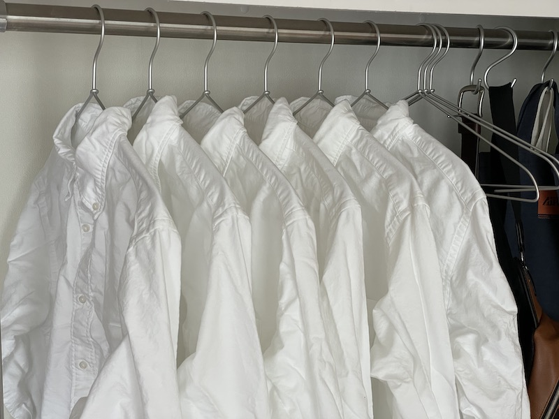
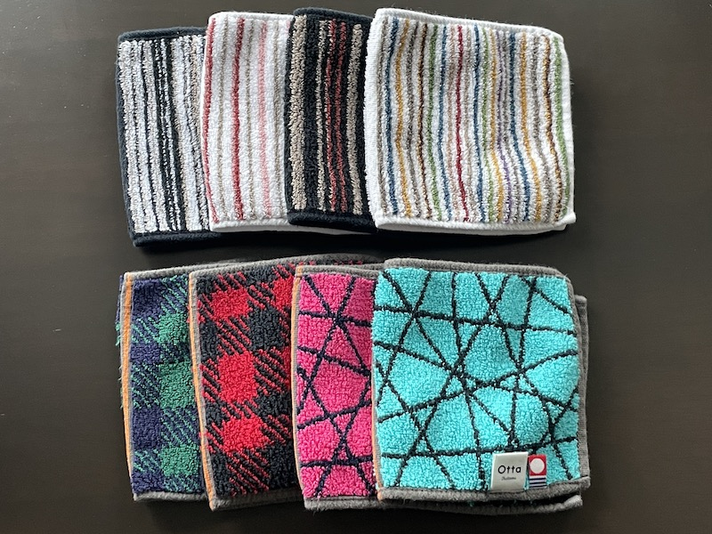
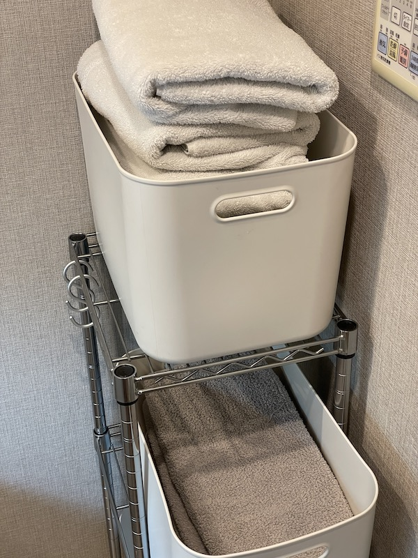

自分はどうやら生活を型にはめるのが好きなようだと気づいたので、現時点でどういう定型化をしているのかを書いてみる。

## 全体的な方針

面倒なことが嫌いなので、

- 日々の運用で考えることを減らせるか
- 買い換え・買い足しが楽にできるか

という観点で選んでいる。

## 衣類

普段着について書く。

運動や冠婚葬祭のための服などは最適化できていない。

### シャツ

毎日、ユニクロのオックスフォードシャツを着ている。
夏は長袖だと暑いので同じくユニクロのポロシャツ。

他のメーカーのものも検討したが、年中安定して調達できる点などを重視した結果、ユニクロに落ち着いた。

毎日着るものとして白いシャツを選んでいる理由は

- 襟付きのシャツが好き
- 生地が伸びにくくて洗濯乾燥機にかけやすい
- 白シャツならわりとベーシックなので毎日来ていてもバレにくいのではないか
- [@puzzeljp](https://twitter.com/puzzeljp) に「黒い服を着てると怖い」と言われた

あたり。

ある程度の数を確保して負荷分散をしておかないとシーズンの途中で痛んでくるので、単純な洗い替え以上の枚数を買う運用になる。
また、逆にある程度の数に抑えておくとシーズンの終わり頃にはそれなりに痛んでくるので、シーズンの終わりとともにすべて捨てる運用ができて、オフシーズンの収納が不要になる。

洗濯が終わったものを右に吊って、着るときには左から取っていくことで循環する queue (FIFO) になって、すべてのシャツの痛み具合をほぼ均等にできるという pro tip がある。

### ジーンズ

今まではテキトーに選んでいたが、今年からは「服に色はいらないのでは？」という発想により黒いジーンズになった。無彩色は便利。

以前は EDWIN や Wrangler あたりを穿いていることが多かったが、調達性の観点からユニクロになった。

### 靴下

黒い靴下を2種類だけ持っている。3シーズン用の普通の丈が10足くらい、夏・室内用のくるぶし丈のものを10足くらい。

靴下を揃えておくと洗濯後の神経衰弱が不要になるのでコスパが高い。
新しいものと古いものが混在すると神経衰弱が必要になるので、痛んできたなと思ったらまるっと買い換える運用にしている。

元々はユニクロの靴下を使っていたが、無印良品の足なり直角靴下を試用中。

### タオルハンカチ

田中産業というところの Otta というやつを使っている。\
https://goldpearl.shop-pro.jp/?mode=grp&gid=1801008&sort=p

ハーフサイズのタオルハンカチでかなり使いやすい。10枚ちょい所有している。Amazon にもある。\
https://amzn.to/3bu5mP7

これについては以下の観点から、色や柄を揃えたりはしていない。

- 色や柄のラインナップが結構更新されるので、揃えてしまうと買い足しができなくてつらい
- 「こいつ毎日同じハンカチ使ってね？」はさすがに避けたい
- 他のところに変化がなさすぎるので少しくらい遊んでも良いのでは

### 部屋着

ここ1年半くらい作務衣を部屋着にしている。

3着持っているが、上下のペアリングが必要になるため多色展開の商品から色を分けて買っている。\
https://amzn.to/3jO2Hob

## 生活用品

### タオル

バスタオルとフェイスタオルで色を分けている。\
（光の加減でわかりにくいかもしれないが、上のバスタオルが白で、下のフェイスタオルがグレー）

洗濯物の山から一目で判別しながら取り出せて結構便利。

重めのタオルが好きで昔はニトリのタオルを愛用していたが、追加調達ができなかったのを機に無印良品の中厚手に移行した。

ここが queue (FIFO) じゃなく stack (LIFO) になっていて、痛み具合に差がでるのが課題。

### 収納

全体的に無印良品の収納にお世話になっている。ポリプロピレン収納とやわらかポリエチレンケースの採用が多い。\
https://www.muji.com/jp/ja/store/cmdty/section/T20004

無印良品は商品の規格を揃えて設計してくれているのと、商品の息が長いのが本当にえらい。ありがとうございます。
