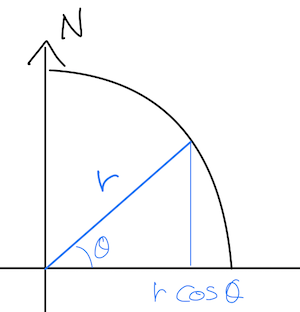
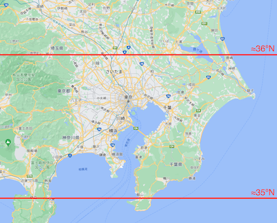

地理的な計算をする際、計算を楽にするために緯度経度を平面座標として扱いたいことがある。
ただし、我々が立つ地面は平らではないことが知られているので、球面上の座標情報である緯度経度を平面座標に近似して扱っても問題ないかを検討する必要がある。

なお、地理系の関数を用いて計算できる場合はそれを使えば良いし使うべきなので、適切な関数がない場合を主に想定している。

# 前提

- 地球を半径 $r$ の球として扱う
    - 実際には凹凸があるし遠心力で横に膨らんでいるが簡単のために無視する
- 弧の長さの公式 $l = r \theta$
    - $l$: 弧の長さ
    - $r$: 半径
    - $\theta$: 中心角 (rad)

# 緯度（南北）方向の誤差

緯度方向については誤差はない。

緯度1度は中心角でも常に1度になるため、$\Delta\theta_{\mathrm{lat}}$ を緯度方向の角度とすると $l = r \Delta\theta_{\mathrm{lat}}$ が成立するし、緯度1度あたりの距離は $\frac{1}{180} \pi r$ になる。

# 経度（東西）方向の誤差 〜ざっくり編〜

経度1度に対応する中心角は緯度によって変わる。
経度1度は赤道上では中心角1度に相当するが、南北に移動するにしたがって経度1度に対応する中心角は小さくなっていく。

このことは「赤道を1周するのは大変だが、北極点すぐそばを1周するのは（めっちゃ寒いことを除けば）簡単」ということからも想像できる。

緯度 $\theta_{\mathrm{lat}}$ の地点における地軸から地表までの距離は $r \cos\theta_{\mathrm{lat}}$ になる。

これを半径として弧の長さの公式に代入すると、緯度 $\theta_{\mathrm{lat}}$において経度が $\Delta\theta_{\mathrm{lon}}$ 変わったときの距離は $r \Delta\theta_{\mathrm{lon}} \cos\theta_{\mathrm{lat}}$ になる。

これを用いて、たとえば北緯35度と36度でどれくらい東西方向の距離が変わるのかという計算をしてみると（$r \Delta\theta_{\mathrm{lon}}$ は約分されてキレイに消えるので）

$$
\frac{\cos \frac{36}{180} \pi}{\cos \frac{35}{180} \pi} = 0.9876273886
$$

となって、1.3%程度の誤差しか生じないことがわかる。

ちなみに、北緯35度と36度というとこれくらいの範囲。
ただし、線は手で引いているので多少誤差あり。

もちろん用途にはよるものの、実際にはもっと局所的な比較をすることがほとんどだと思うので、実用上の誤差は1.3%よりも小さくなるはず。

# 経度（東西）方向の誤差 〜ちゃんとやる編〜

実は上の計算は正確ではない。

地軸に垂直な平面と地表の交点の長さを求めているため、上で求めた経度方向の長さは球面上での最短距離になっていない。

そこで、球面上での最短距離についての誤差を求めてみる。
この概念には大円距離という名前がついているらしく、中心角を求める公式もある。 \
https://ja.wikipedia.org/wiki/%E5%A4%A7%E5%86%86%E8%B7%9D%E9%9B%A2

半径は $r$ で一定なので、中心角の比から距離の比を求めることができて、上と同じように北緯35度と36度で計算してみると 0.987627182 という結果になった。

誤差の程度としては大きくは変わらず、ざっくり計算したときと6桁一致している。

# おわりに

関東くらいの緯度であれば緯度経度を平面座標として扱ってもそれほど大きな誤差は生じないということがわかった。
この誤差を許容できるかどうかは場合によるが、自分のユースケースでは充分許容できる誤差だった。

この誤差を許容できない場合、 [地球楕円体](https://ja.wikipedia.org/wiki/%E5%9C%B0%E7%90%83%E6%A5%95%E5%86%86%E4%BD%93)上での楕円幾何学をやる必要がありそうで大変。

2点間の距離くらいであれば球面で扱うのもそれほど大変ではないが、もう少し複雑な幾何学的計算なんかをしたくなってきたときは平面座標として扱えると嬉しさがかなり増してくるはず。

それにしてもやっぱり三角関数は便利ですね。

